# 📒 BOOKSNAP Development Log

### 2026-03-31

### 🛠️ Django Admin을 활용한 운영 효율 개선 및 데이터 관리 기능 구현
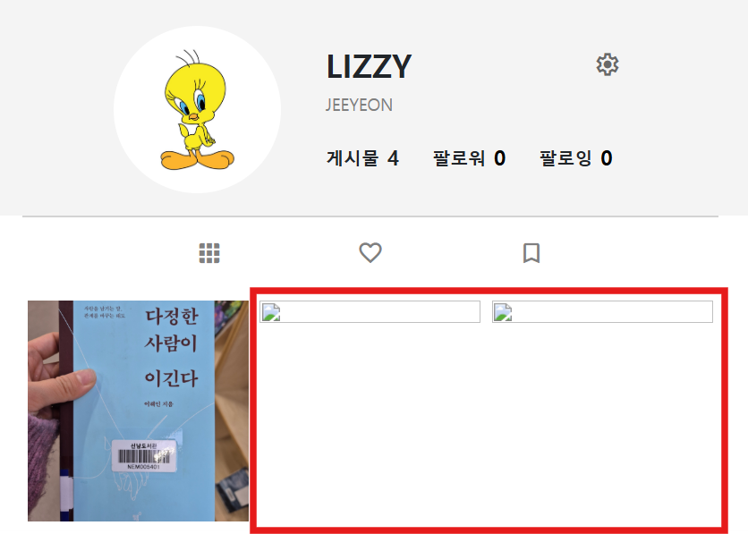
- 문제) 서비스 운영 과정에서 잘못된 이미지 경로로 인해 게시물이 정상적으로 렌더링되지 않는 문제가 발생<br>
  → 프론트엔드에서 직접 수정하기 어려운 데이터를 효율적으로 관리하기 위해 Django Admin을 활용<br>
    (관리자 페이지를 통해 데이터 조회, 수정, 삭제를 빠르게 수행할 수 있도록 구조 개선)
<br><br>

### 1. 🖥️ Admin 페이지 활성화 및 모델 등록
<div style="display: flex; justify-content:left; gap: 10px">
  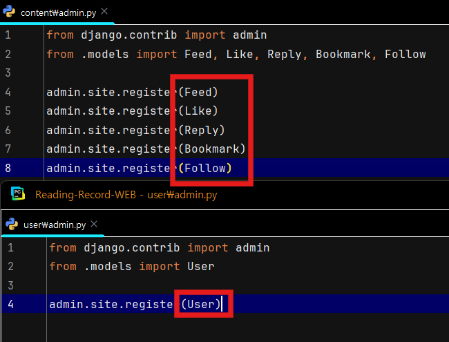
  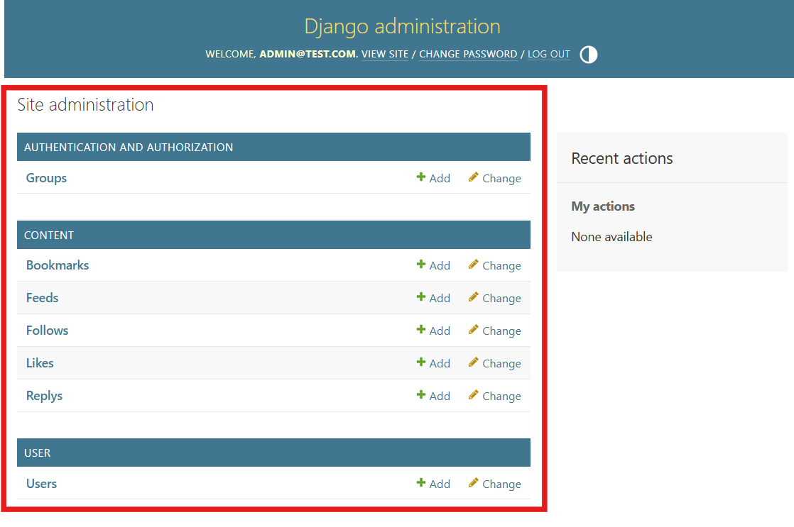
</div>

- 서비스의 핵심 데이터 관리 효율을 높이기 위해 주요 모델을 Admin에 등록
  - content/admin.py: Feed, Like, Reply, Bookmark, Follow 모델
  - user/admin.py: Custom User 모델
- 이를 통해 관리자 페이지에서 서비스 데이터를 직접 조회하고 제어할 수 있는 환경 구축
<br><br>

### 2. ✨ Admin 디테일 및 프리뷰 기능 구현
<div style="display: flex; justify-content:left; flex-direction: column; gap: 10px">
  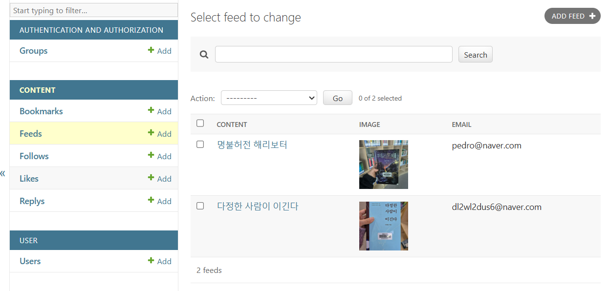
  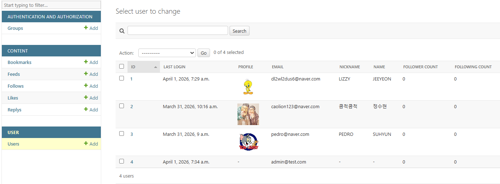
</div>

- 단순 텍스트 기반 리스트의 한계를 개선하기 위해 `format_html`을 활용하여 이미지 프리뷰 기능 구현
  - Feed 이미지 썸네일 표시 (`image_preview`)
  - 프로필 이미지 표시 (`profile_preview`)
- 사용자 관리 효율 향상을 위해 Admin UI 구조 개선
  - `fieldsets`를 활용하여 정보 그룹화 (기본 정보 / 사용자 정보 / 권한)
  - `readonly_fields`를 적용하여 비밀번호 필드 보호
- Follow 데이터를 기반으로 사용자 관계를 직관적으로 파악할 수 있도록 개선
  - 각 유저의 팔로워 / 팔로잉 수를 Admin 리스트에서 실시간 계산하여 표시
<br><br>

### 3. 🗑️ 데이터 정리 (Data Cleaning)
<div style="display: flex; justify-content:left; gap: 10px">
   ➡️ 
  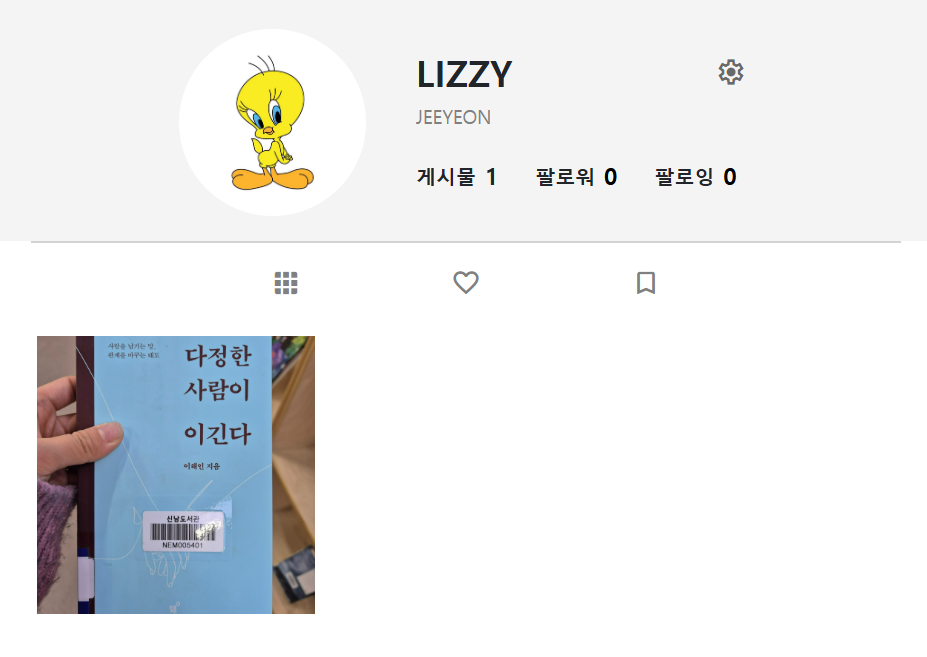
</div><br>
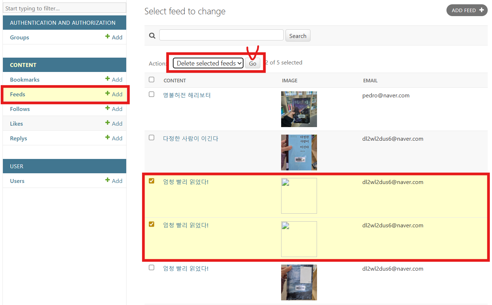

- 이미지 경로 오류로 인해 프론트엔드에서 깨진 게시물이 발생하는 문제 확인
- Admin의 bulk action 기능을 활용하여 문제 데이터를 효율적으로 제거
- 체크박스와 `Delete selected feeds` 기능을 통해 다수의 데이터를 한 번에 삭제
  - 잘못된 이미지 경로를 가진 Feed 2개 삭제
- 결과적으로 사용자 프로필 페이지의 UI가 정상적으로 복구되고 데이터 정합성 확보
 <br><br>

📌 **배운 점**
- 단순히 기능을 만드는 것뿐만 아니라, 운영 중 발생하는 데이터를 관리하는 방법과 중요성을 학습
- Django Admin을 통해 코드 수정 없이도 데이터를 빠르게 확인하고 수정할 수 있어 운영 효율이 크게 올라간다는 것을 체감 
  - 특히 설정에 따라 형태가 달라지는데, 더 편리하게 관리할 수 있도록 시각적으로 개선해 본 경험이 인상적이었음
<br><br><br><br>

---

## 2026-03-30

### 🛠️ 개발 환경 설정
- MySQL(RDS) 기반 설정을 로컬 환경에서도 그대로 사용할 경우, `mysqlclient` 설치 문제로 인해 `runserver` 실행이 불가능한 상황 발생
- 이를 해결하기 위해 `local_settings.py`를 추가하고 `try-except` 구문을 활용하여 환경에 따라 DB 설정을 자동으로 전환하도록 구조 개선
- 로컬 환경에서는 SQLite를 사용하여 빠르게 개발 및 테스트를 진행하고,
  배포 환경에서는 `local_settings.py`가 존재하지 않기 때문에 기본 설정(RDS)이 적용되도록 구성
<br><br>
  - 로컬 환경(`local_settings.py`)
  ```
  DATABASES = {
      'default': {
          'ENGINE': 'django.db.backends.sqlite3',
          'NAME': BASE_DIR / 'db.sqlite3',
      }
  }
  DEBUG = True
  ```
  - 공통 환경(`settings.py`)
  ```
  try:
      from .local_settings import * 
  except ImportError:
      pass 
  ```

📌 **배운 점**
- 동일한 코드베이스에서 환경에 따라 설정을 다르게 적용하는 방법과 필요성 이해
<br><br><br><br>

---

## 2026-03-28

### 🦤 DuckDNS를 활용한 도메인 연결
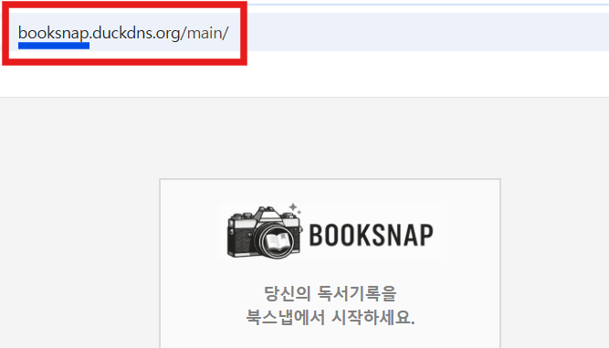

- 기존) EC2 Public IP(3.26.24.175) 사용 : 기억하기 어렵고, IP 변경 시 재설정 필요
- 변경) DuckDNS를 활용하여 `booksnap.duckdns.org` 도메인 생성 후 EC2 IP와 연결
  - Django 설정에 `ALLOWED_HOSTS = ['booksnap.duckdns.org']` 추가
  - Nginx 설정에서 `server_name booksnap.duckdns.org;`로 변경
<br><br>

### 💼 Django DB 환경 전환 (SQLite → Docker MySQL → AWS RDS)
- SQLite는 파일 기반 DB로 간편하지만, 동시성 처리 및 확장성 측면에서 한계 존재
- 실제 서비스 환경을 고려하여 MySQL 기반 구조로 전환 시도<br>
<div style="display: flex; justify-content:left; gap: 10px">
  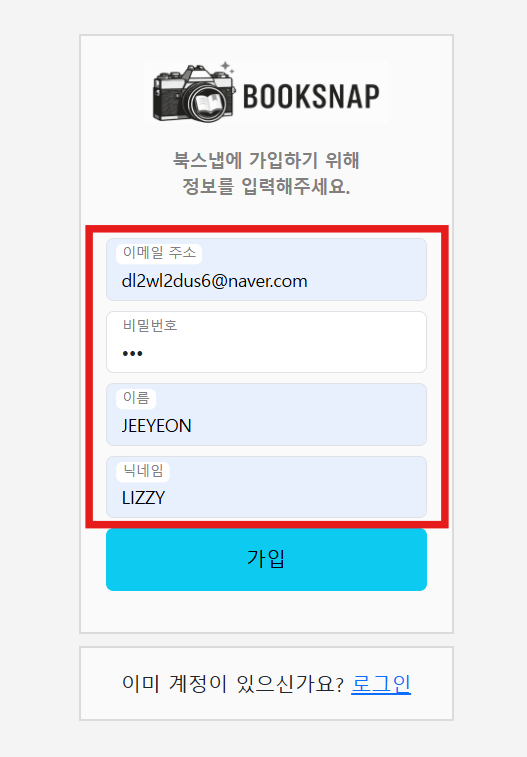
  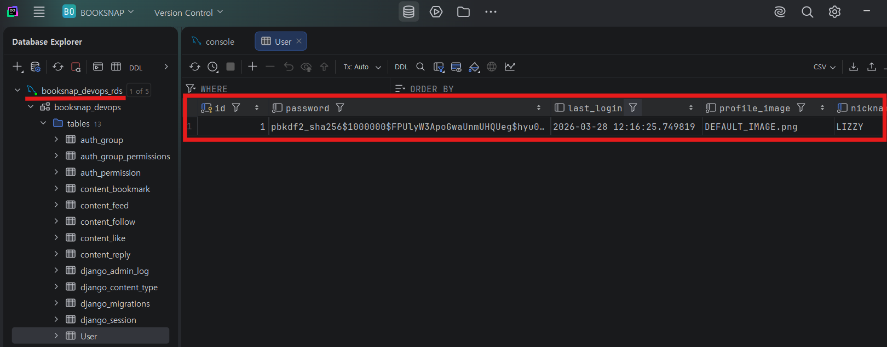
</div>

<br><br>

### 🐳 방법 1. Docker 기반 MySQL 연동
- Docker로 MySQL 실행
  - 서버에 직접 MySQL을 설치하는 대신, 환경 분리 및 관리 편의성을 위해 docker 활용
```
sudo docker run --name booksnap-db -p 3306:3306 
-e MYSQL_ROOT_PASSWORD=password \
-e MYSQL_PASSWORD=password mysql
```
- 보안 그룹 설정 : EC2 인바운드 규칙에 3306(MySQL) 포트 추가
- DataGrip에서 MySQL 연결 (EC2 IP + 3306 포트 → DB 생성 `booksnap_devops`)
- Django DB 설정 변경 (SQLite → MySQL)
```
DATABASES = {
    'default': {
        'ENGINE': 'django.db.backends.mysql',
        'NAME': 'booksnap_devops',
        'HOST': '3.26.24.175',
    }
}
```
- 마이그레이션 `python3 manage.py migrate`<br>
    👉 DataGrip에서 테이블 생성 확인
<br><br>

### ☁️ 방법2. AWS RDS로 MySQL 연동
- RDS MySQL 인스턴스 생성
  - VPC 보안 그룹: db-booksnap-devops
- 보안 그룹 설정 : EC2 → RDS 보안 그룹 설정
  - RDS 보안 그룹에서 MySQL(3306) 포트를 허용하고, 소스를 EC2로 제한하여 외부 접근을 차단하고 서버에서만 DB 접근이 가능하도록 설정
- DataGrip에서 RDS 연결 (RDS endpoint + 3306 포트 → DB 설정)
- Django DB 설정 변경 (RDS 기준)
```
DATABASES = {
  'default': {
      'ENGINE': 'django.db.backends.mysql',
      'NAME': 'booksnap_devops',
      'HOST': 'db-booksnap-devops.czyskiuc2m17.ap-northeast-2.rds.amazonaws.com',
  }
}
```  
- 마이그레이션 `python3 manage.py migrate`<br>
    👉 RDS에 테이블 생성 확인
<br><br>

### 🔐 환경변수로 시크릿 정보 분리
DB 계정, 비밀번호 등 민감 정보를 코드에서 분리하여 관리하고자 함
<div style="display: flex; justify-content:left; flex-direction: column; gap: 10px">
    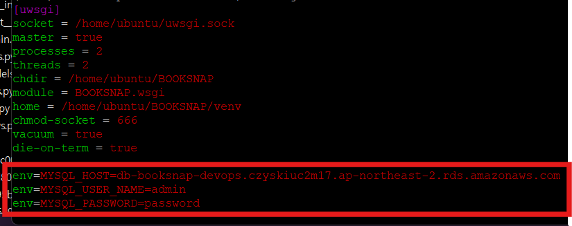 
    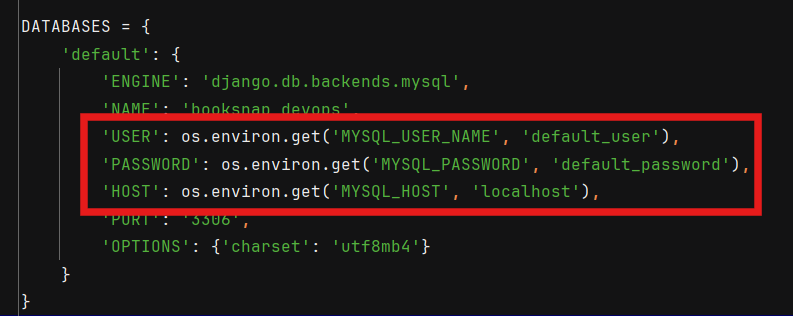
</div>
<br><br>

📌 **배운 점**
- 웹 동작 흐름 이해
  - (사용자) 브라우저에 URL을 입력 → (DNS) 도메인이 IP 주소로 변환 → (브라우저) 서버에 HTTP 요청 
    → (서버) 해당 요청을 처리하여 HTML, CSS, JS 응답 → (브라우저) 렌더링하여 화면에 표시
- 환경변수 기반 설정 관리 필요성  
  - DB 계정 및 비밀번호와 같은 민감 정보를 코드에서 분리하고, 환경변수를 통해 관리하는 방식의 필요성과 실행 방법 이해 
  - DB 구조 분리를 통한 서비스 구조  
    - EC2 내부 DB(Docker)와 외부 DB(RDS)를 비교하며, 서비스와 데이터베이스를 분리하는 구조의 안정성과 확장성 이해

    | 구분    | 🐳 Docker MySQL (방법 1)              | ☁️ AWS RDS (방법 2)             |
    | ----- |-------------------------------------|-------------------------------|
    | DB 위치 | EC2 내부<br>→ 서버 + DB가 한 곳에 존재        | AWS 별도 서버<br>→ 서버와 DB가 분리된 구조 |
    | 안정성   | 서버 장애 시 DB도 영향 받음                   | DB는 독립적으로 유지                  |
    | 확장성   | 제한적 (서버 성능 의존)                      | 수평/수직 확장 가능                   |
    | 특징    | 빠르게 구축 가능하고 비용 부담이 없으나,<br>DB를 직접 운영·관리해야 함 | 비용이 발생하지만,<br> 자동 관리로 안정성이 높고 확장이 용이함 |
<br><br><br><br>

---

## 2026-03-26
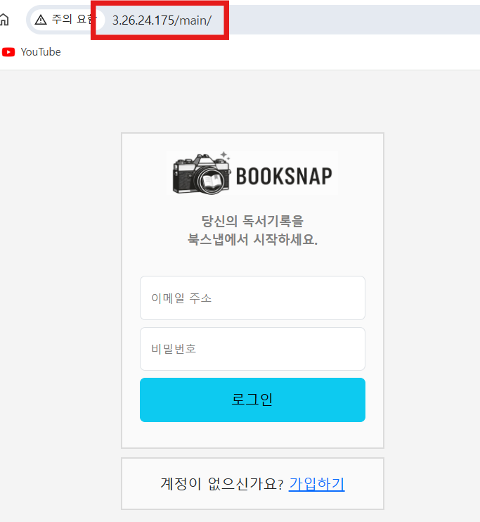

### 🚀 Nginx + uWSGI + Django 배포 환경 구축

### 1. 아키텍처 : Nginx → uWSGI → Django
기존의 Django `runserver`는 개발용 서버로 성능과 안정성에 한계가 있음<br>
이를 보완하기 위해 `Nginx -uWSGI - Django` 구조로 분리하여 구성<br>
이 구조를 통해 요청 처리 역할을 나누고, 성능과 안정성을 개선함
- **Nginx (Web Server)** : 사용자의 요청을 가장 먼저 받는 진입점
  - 정적 파일(CSS, JS, 이미지)은 직접 처리하여 빠르게 응답
  - 동적 요청(로그인 처리, DB 조회 등)은 uWSGI로 전달하여 Django에서 처리하도록 분리
- **uWSGI (Web Application Server)** : Nginx와 Django 사이의 인터페이스 역할
  - Nginx로부터 받은 요청을 Django가 처리할 수 있는 형태로 전달
  - Django의 처리 결과를 다시 Nginx로 반환
- **Django (Web Framework)** : 실제 애플리케이션 로직 처리
  - 데이터베이스 조회, 사용자 인증, 게시글 처리 등 비즈니스 로직 수행

### 2. Apache vs Nginx (Nginx 선택)

| 구분 | Apache | Nginx  |
| ---- | ------ | ------ |
| 구조 | 프로세스/쓰레드 기반<br>(요청 1개마다 프로세스 또는 쓰레드 생성 → 동시 요청 증가 시 자원 사용 급증) | 이벤트 루프 기반<br>(소수의 프로세스로 다수의 요청을 이벤트로 처리 → 높은 동시성 유지)  |
| 특징 | 요청마다 독립적으로 처리하여 안정적이지만, 요청이 많아질수록 메모리와 CPU 사용량이 크게 증가  | 요청을 비동기적으로 처리하여 적은 자원으로도 대량의 동시 요청 처리 가능|
| 강점 | 다양한 모듈 지원 및 유연한 설정| 정적 파일 처리 속도가 빠르고, reverse proxy로서 효율적인 요청 분배 가능 |

💡 **Nignx 선택 이유**<br>
Apache는 요청마다 프로세스를 생성하는 구조로 동시 접속이 많아질수록 자원 소모가 증가하는 반면, Nginx는 이벤트 기반 비동기 구조로 적은 자원으로도 많은 요청을 효율적으로 처리할 수 있음. 특히 정적 파일 처리 성능이 뛰어나고 메모리 사용량이 적어, EC2와 같은 제한된 환경에서 더 적합함

### 3. EC2 보안 설정 (HTTP 80 포트 개방)
- 기존에는 개발용 포트(8000)를 사용했지만, 실제 서비스 환경에서는 기본 HTTP 포트인 **80번 포트**를 사용
- 이를 위해 AWS Security Group에서 **80번 포트**를 허용하여 외부에서 HTTP 요청이 들어올 수 있도록 설정 
- 이후 Nginx가 해당 포트를 통해 들어오는 요청을 받아 처리하도록 구성<br>

  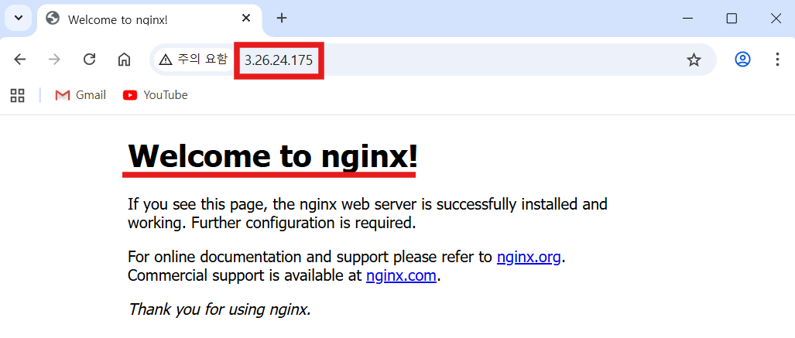<br>
  ➡️ 외부 요청이 EC2 인스턴트를 거쳐 Nginx까지 정상적으로 도달했음 의미 

### 4. Unix Socket vs TCP (Unix Socket 선택)
Nginx와 uWSGI 간 통신 방식

| 구분  | TCP                      | Unix Socket            |
| ----- | ------------------------ | ---------------------- |
| 방식| 네트워크 기반 (IP + Port)<br> `127.0.0.1:8000` | 파일(`uwsgi.sock`) 기반<br>`/home/ubuntu/uwsgi.sock` |
| 처리 구조 | 네트워크 스택을 거쳐 전달 → 오버헤드 존재 | 파일로 직접 전달 → 오버헤드 거의 없음 |
| 속도    | 상대적으로 느림 | 더 빠름(불필요한 과정 없음)|
| 사용 환경 | 서버 간 통신 가능 | 동일 서버 내부 통신  |

💡 **선택 이유**<br>
동일 서버 내 통신에서는 네트워크 스택을 거치지 않는 Unix Socket이 더 빠르고 효율적이며, 파일 권한 기반으로 접근을 제어할 수 있어 보안 측면에서도 유리

### 5. uWSGI 설정 파일 (uwsgi.ini)
명령어 실행 대신 설정 파일 기반으로 uWSGI를 관리하도록 구성
```ini
[uwsgi]
# 프로젝트 경로 및 파이썬 가상환경 설정
chdir = /home/ubuntu/BOOKSNAP
module = BOOKSNAP.wsgi
home = /home/ubuntu/BOOKSNAP/venv

# Nginx와 통신할 소켓 설정
socket = /home/ubuntu/uwsgi.sock
chmod-socket = 666                      # socket 접근 권한 설정
vacuum = true                           # uWSGI 종료 시 socket 파일 자동 삭제 

# 프로세스 및 스레드 설정 (동시 요청 처리)
master = true
processes = 2
threads = 2

# 로그 설정 
logto = /home/ubuntu/uwsgi.log         # 로그 파일 저장 위치

;daemonize = /home/ubuntu/uwsgi.log    # systemd와 충돌 방지 위해 주석 처리
```
- uWSGI는 systemd를 통해 서비스로 등록하여, 서버 재시작 이후에도 자동으로 실행되도록 구성하였다.

### 6. Nginx 설정 (default 제거 및 재구성)
기존 default 설정을 제거하고, uWSGI와 직접 연결되는 구조로 재작성
특히 80번 포트를 통해 들어온 요청을 uWSGI의 Unix Socket으로 전달하도록 설정
```nginx
server {
    listen 80;                                       # HTTP 기본 포트로 외부 요청 수신
    server_name 3.26.24.175;                         # EC2 고정 IP

    charset utf-8;
    client_max_body_size 80M;                        

    location / {
        include /etc/nginx/uwsgi_params;
        uwsgi_pass unix:/home/ubuntu/uwsgi.sock;     # uWSGI 소켓으로 요청 전달
    }
}
```
<br>

### ❌ 502 Bad Gateway 에러 발생
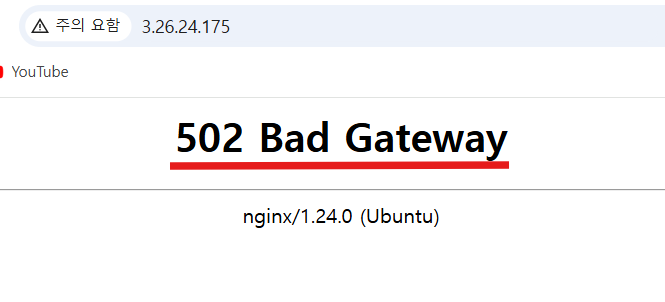

마지막 단계에서 Nginx와 uWSGI 간 연결 실패로 인한 **502 Bad Gateway** 발생

#### 원인 1. 소켓 접근 권한 문제
Nginx와 uWSGI가 통신하기 위해서는 `uwsgi.sock` 파일에 대한 상호 접근 권한이 필수
- 파일 자체의 권한(`chmod 666`)
  - `Nginx는 `www-data' 유저로 실행되고, uWSGI는 `ubuntu` 유저로 실행됨. 소유 유저가 서로 다르기 때문에 Nginx가 소켓 파일을 읽거나 쓸 수 없는 권한 문제 발생
  - 해결) 외부 프로세스인 Nginx가 접근할 수 있도록 소켓 파일 권한을 666으로 개방하여 유저 간 통신 장벽 제거 
- 디렉토리 실행 권한(`chmod 755 /home/ubuntu`)
  - 파일 권한이 있더라도, 소켓 파일이 들어있는 폴더(`/home/ubuntu`)에 접근 권한이 없으면 파일의 위치를 찾을 수 없음
  - 해결) `/home/ubuntu` 디렉토리 권한을 `755`로 수정하여 Nginx(`www-data`) 유저가 접근할 수 있도록 경로 확보
```bash
sudo chmod 755 /home/ubuntu
sudo chmod 666 /home/ubuntu/uwsgi.sock
```

#### 원인 2. uWSGI 실행 방식과 systemd 충돌
`daemonize`(uWSGI를 백그라운드에서 직접 실행하는 방식)와 `systemd`(OS 레빌의 서비스 관리 도구) 간의 관리 주체 충돌 발생
- `daemonize` 옵션의 오용
  - `uwsgi.ini`의 `daemonize` 옵션(#5)은 프로세스를 스스로 백그라운드(데몬)로 전환하는 반면, `systemd`는 자신이 직접 프로세스를 추적하고 관리해야 함
  - uWSGI가 스스로 데몬화되어 숨어버리자, 이를 감시하던 `systemd`는 프로세스가 종료된 것으로 오판하여 서비스를 중단시키는 무한 재시작 루프에 빠짐
  - 해결) `uwsgi.ini`에서 `daemonize` 옵션을 제거하고, `systemd` 설정(`uwsgi.service`)의 타입을 `Type=simple`로 지정. OS가 직접 uWSGI의 생명주기를 관리하도록 구조 개선
<br>

### 📌 최종 결과
- Nginx → uWSGI → Django 구조 구축 완료
- 80번 포트를 통한 외부 접속 가능
- PuTTY 종료 후에도 서버 지속 실행
<br>

📌 **배운 점**
- 웹 서버와 애플리케이션 서버를 분리하는 구조의 중요성 이해
- 정적/동적 요청 분리를 통한 성능 개선 경험
- 작은 설정 오류 하나가 전체 시스템에 영향을 준다는 점 체감
- 특히 **502 에러는 대부분 uWSGI 연결 문제**라는 점을 실전에서 학습
<br><br><br><br>

---

## 2026-03-24
<div style="display: flex; justify-content:left ; gap: 10px">
  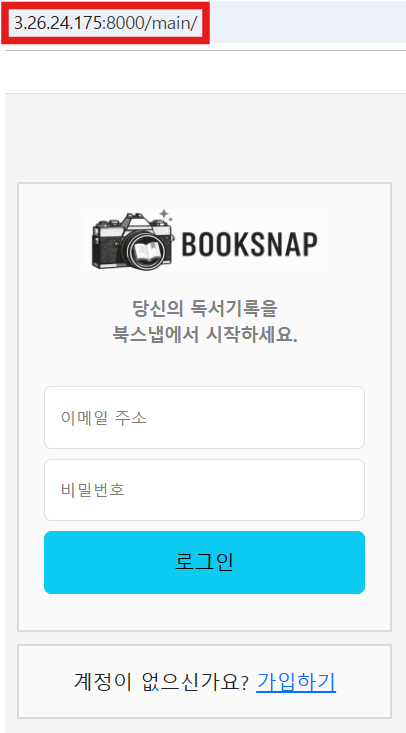
  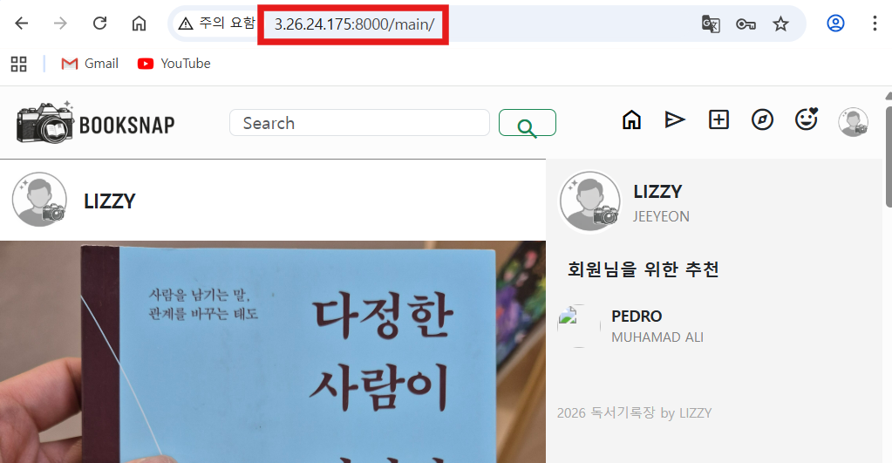
</div><br>

### 🚀 EC2를 활용한 BOOKSNAP 배포
- 로컬 환경(127.0.0.1)에서만 동작하던 Django 프로젝트를 AWS EC2에 배포하여 외부에서도 접속 가능하도록 구현
- GitHub에 업로드한 프로젝트를 활용하여, EC2에서 clone 및 pull을 통해 동일한 코드 환경 구성
- `python3 manage.py runserver 0.0.0.0:8000`로 서버 실행 후 퍼블릭 IP를 통해 접속 확인
- 배포 과정에서 발생한 중 문제와 해결 과정은 다음과 같음

### 문제 1. 퍼블릭 ip로 접속 불가
- EC2에서 서버는 실행되었지만 외부 접속이 되지 않는 문제 발생
- 원인) Django 및 AWS 네트워크 설정 미흡
- 해결 1) `ALLOWED_HOSTS = ['*']` 설정을 통해 외부 ip 접근 허용
- 해결 2) EC2 보안 그룹에서 8000 포트 개방하여 외부 요청 허용

### 문제 2. URL 경로 중첩 문제
<div style="display: flex; justify-content:left ; gap: 10px">
  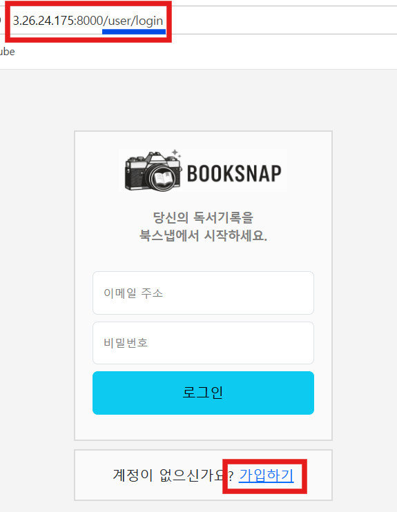
  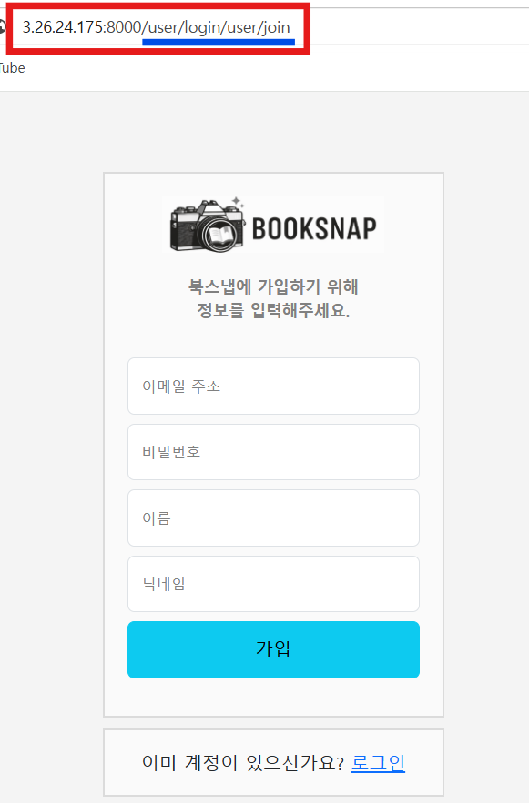
</div><br>

- 로그인 화면(`/user/login`)에서 '가입하기' 클릭 시 `/user/login/user/join` 형태로 잘못된 URL 생성
- 원인) 상대경로(`user/login`, `user/join`) 사용으로 현재 URL 뒤에 이어붙는 문제 발생
- 해결) 절대경로(`/user/login/`, `/user/join/`)로 수정하여 올바른 라우팅 처리


### 문제 3. 로고 등 이미지 미출력
<div style="display: flex; justify-content:left ; gap: 10px">
  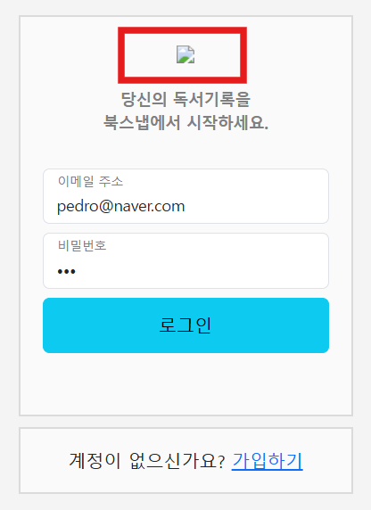
  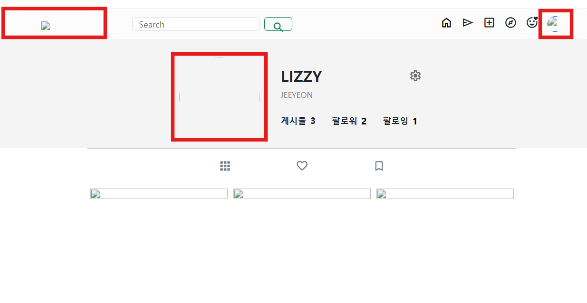
</div><br>

- 페이지는 정상 렌더링되지만 이미지가 표시되지 않는 문제 발생
- 원인) static 경로 설정 문제 또는 서버 환경에서의 경로 인식 차이
- 해결)  대신 실제 이미지 URL을 직접 삽입하여 해결
  - 캐시 삭제 이후 다른 static 이미지는 제대로 출력되는 걸 보니 단순 캐시 문제였을수도,,

📌 **배운 점**
- Django는 URL, 인증, 요청 방식 등에 있어 서버 환경에서 더 엄격하게 동작함
  - 특히 URL 뒤의 `/`의 중요성(절대경로)을 체감
- Git을 활용하면 특정 시점으로 쉽게 되돌릴 수 있어, 문제 해결 과정에서 매우 유용함을 체감
- 브라우저 캐시로 인해 변경 사항이 반영되지 않는 경우가 있으며, 이럴 때는 캐시 삭제가 효과적임
<br><br><br><br>

---

## 2026-03-20

### 1. 게시물 클릭 시 모달 화면 구현
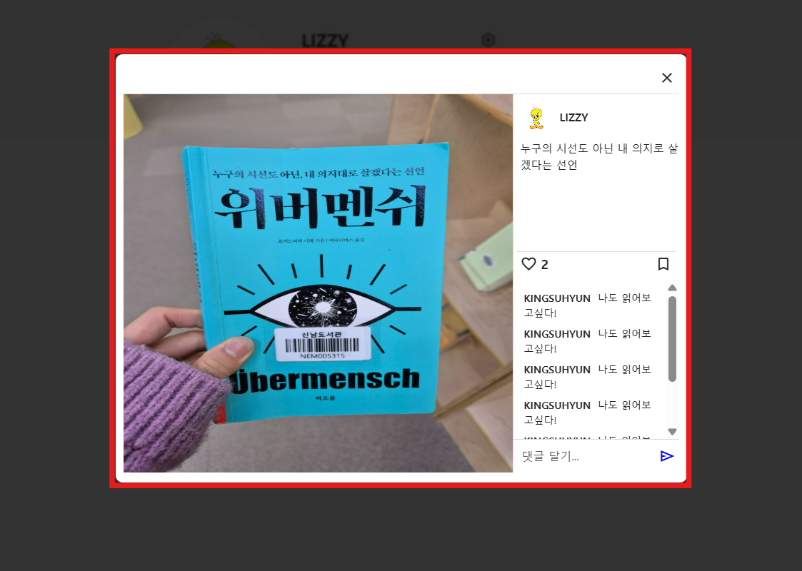<br>

- HTML(클릭) → JS(AJAX 요청) → Django View(데이터 조회) → JSON 응답 → JS → 모달 표시
  - HTML: ``
  - JS : `$('.feed_post').click(function () {`
  - 서버 요청 `$.ajax({url: "/content/feed_detail", method: "GET", data: {feed_id: feed_id} {) `
  - View : `def feed_detail(request):`
  - DB : `feed = Feed.objects.get(id=feed_id)`
  - JSON : `return JsonResponse({'image': feed.image.url, 'content': feed.content, 'nickname': feed.user.nickname })`
  - 모달 : `$('#modal_image').attr('src', data.image);`
  ```
    # data-feed-id 추가
  ```
- 개선 점
  - 새로고침을 하지 않고 게시물을 누르면 댓글이 계속 누적되는 것
  - 해당 게시물의 댓글 가져오는 것
  - Main과 Mysnap 댓글 모두, 닉네임 옆에 프로필 이미지 추가
  - Mysnap의 좋아요, 북마크 기능 구현


### 2. Modal 창
<div style="display: flex; justify-content:left ; gap: 10px">
  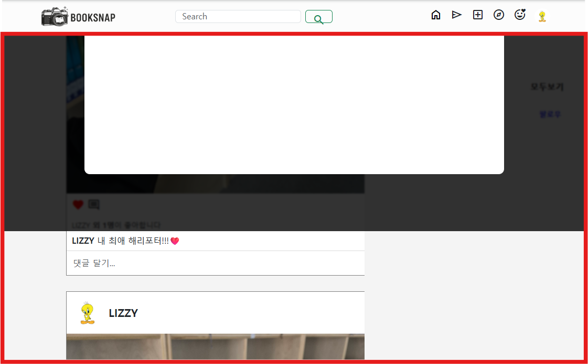
  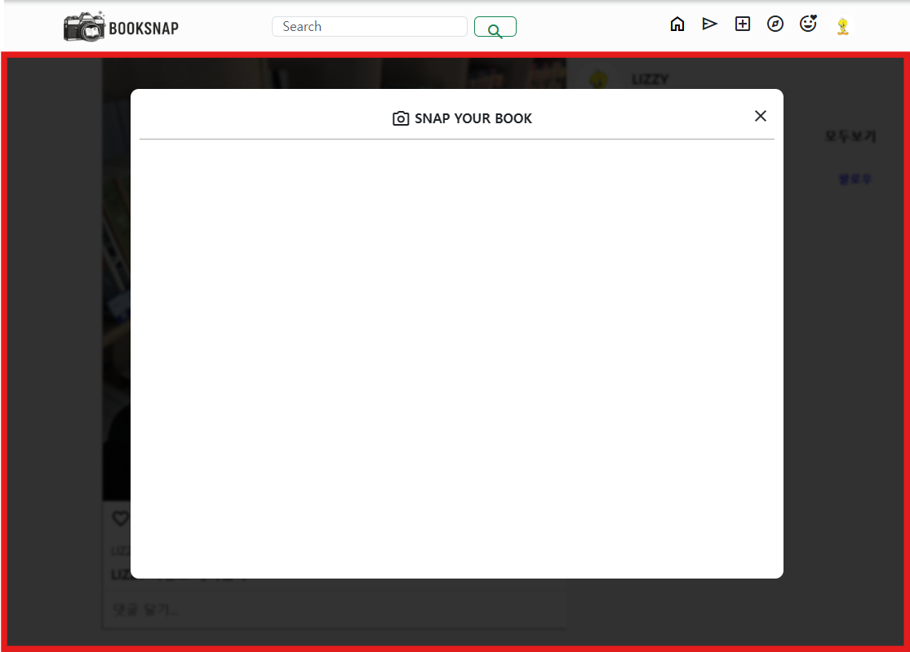
</div><br>

- 문제) Main 화면에서 스크롤을 내린 상태로 `add_box` 버튼을 누르면 Modal 창이 위쪽에 붙여있는 모양으로 열림
- 원인) .modal_overlay {position : absolute}
- 해결) posision : fixed로 변경
<br><br><br><br>

---

## 2026-03-19
팔로워 / 팔로잉 리스트 드롭다운
<div style="display: flex; justify-content:left ; gap: 10px">
  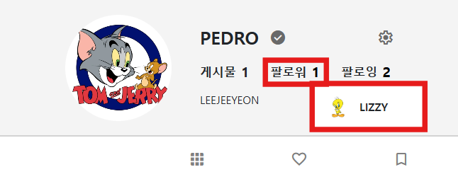
  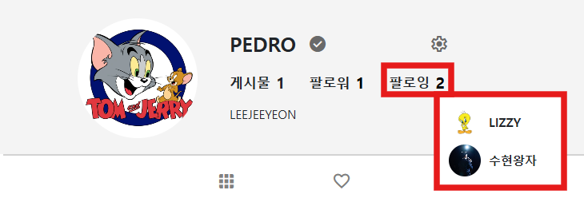
</div>

### 👥 팔로워 드롭다운 기능 구현
- 프로필 화면에서 팔로워 수를 클릭하면 해당 사용자의 팔로워 목록이 드롭다운 형태로 표시되도록 구현
- for 조건문을 사용하여 모든 팔로우 유저 조회 ``
- 문제) 드롭다운에 팔로워 목록이 조회되지 않음<br>
  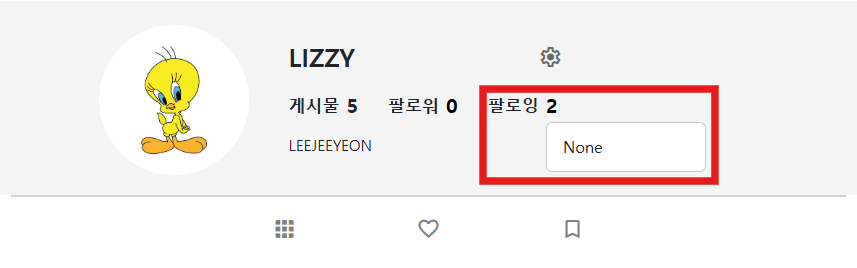
- 원인) `follower`와 `following`의 방향성을 혼동하여 잘못된 기준으로 데이터를 조회 함
- 해결 1) 직관적인 이름으로 혼동 방지 : `from_user`(팔로우 하는 유저), `to_user`(팔로우 받는 유저)
- 해결 2) 기존 email 기반 구조를 ForeignKey로 변경하여 User 모델과 직접 연결되도록 개선

### 🛠️ Follow 모델 구조 개선 (Email → ForeignKey 전환)
- 기존)
```
following_email = models.EmailField()
follower_email = models.EmailField()
```
- 문제) 이 방식은 단순 email 문자열 비교로 관계를 처리하기 때문에 다음과 같은 한계가 있음
  - 1. user 모델과 직접적인 연관이 없어 추가 정보(닉네임, 프로필 이미지 등)를 가져오기 위해 매번 별도 조회 필요
  - 2. user 이메일 변경 시 follow 데이터와의 정합성 깨질 위험
  - 3. 관계의 방향성이 명확하지 않아 `follower`, `following` 개념 혼동
- 변경)
```
from_user = models.ForeignKey(User, on_delete=models.CASCADE, related_name='followings')
to_user = models.ForeignKey(User, on_delete=models.CASCADE, related_name='followers')
```
- ForeignKey 기반 구조로 변경
  - Follow 모델이 User을 직접 참조하게 되어 데이터 일관성 확보, 정합성 보장
  - 이메일이 아닌 객체 기반 관계 관리로 안정성 향상
  - `related_name`을 통해 역참조 가능(`followers`,`followings`)
  - 조회 로직 단순화
  ``` 
  # 기존
  user = User.objects.filter(email=follow.follower_email).first()
  nickname = user.nickname

  # 변경
  nickname = follow.from_user.nickname
  ```
  
📌 **배운 점**
- `ForeignKey`를 활용해 user를 기준으로 데이터 관계를 연결할 수 있음
  - 단순 값(email)이 아닌 객체(User)를 기준으로 관계를 설정해야 정합성과 유지보수성이 확보될 수 있음
- `related_name`(역참조)를 활용하면 코드가 간단하고 명확해짐
  - 역참조를 통해 Follow 모델을 직접 조회하지 않고도 User 기준으로 관계 데이터를 직관적으로 접근할 수 있음 
  ```
  * 역참조가 없다면   followers = Follow.objects.filter(to_user=B)
                     result = []
                     for f in followers:
                         result.append(f.from_user)

  * 역참조 사용 시     B.followers.all()
  ```
<br><br><br><br>

---

## 2026-03-18

1. 피드 프로필 사진 눌러 다른 유저 프로필 들어가기
<div style="display: flex; justify-content:left ; gap: 10px">
  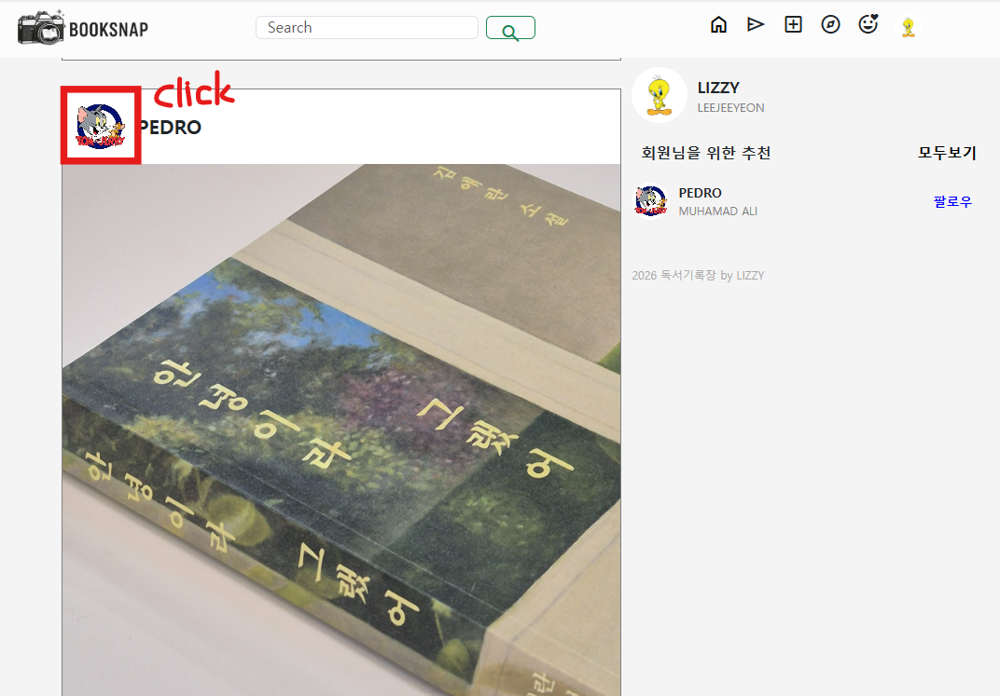
  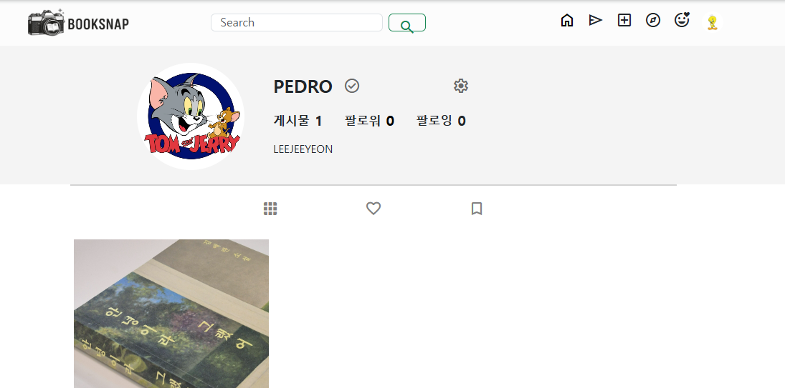
</div><br>

2. 팔로우 버튼 클릭 → 팔로워 수 & 팔로잉 수 카운팅 | 본인 피드 팔로우 버튼 숨기기
<div style="display: flex; justify-content: left; gap: 10px">
  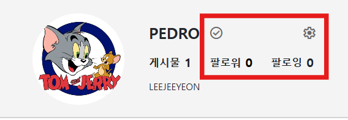
  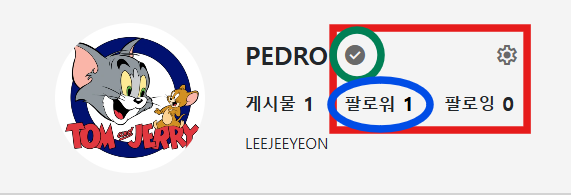
  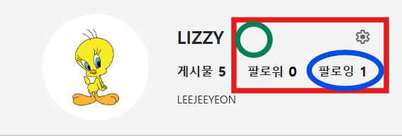
</div><br>

### 👤 프로필 이동 기능(피드 → 다른 유저 프로필)
- 피드에 표시된 프로필 이미지를 클릭하면 해당 유저의 프로필 페이지로 py이동<br>
- 기존에는 `/content/mysnap`으로 로그인 유저 본인의 프로필 조회만 가능했었지만<br>
  URL에 `nickname`을 포함하도록 변경하여 다른 유저 프로필도 조회 가능하도록 개선
  - url : `path('mysnap/<str:nickname>/', MySnap.as_view(), name='mysnap')`
  - html : `<a href="/content/mysnap/{{ feed.nickname }}">`
- 기존에는 `user`로 모든 유저를 통칭하여 사용에 혼란이 있었음. <br>
  `login_user`(현재 로그인한 유저) `profile_user`(그 외 다른 유저)로 구분하여 하나의 템플릿에서 내 프로필과 타인 프로필 모두 처리하도록 개선

### 🔄 팔로우 기능 개선 (Ajax 기반 실시간 반영)
- 팔로우 버튼 클릭 시, 팔로잉 수를 페이지 새로고침 없이 즉시 반영 (비동기 통신)
```
let count = parseInt($('#following_count').text()); 
if (data.is_followed) { 
  $('#following_count').text(count + 1);
} else { 
  $('#following_count').text(count -1); 
  }
```
- 팔로우 버튼 클릭 시, `is_followed` 값을 기준으로 버튼 상태 즉시 변경
```
if(data.is_followed) { 
  $('#' + follow_id).addClass('filled'); 
} else { 
  $('#' + follow_id).removeClass('filled'); 
}
```
- 템플릿 if 조건문을 활용하여 본인 프로필에서는 팔로우 버튼 숨김 처리
``

📌 **배운 점**
- URL에 파라미터(`nickname`)을 포함하여 하나의 View로 다양한 사용자 데이터를 처리할 수 있음
- `path(..., name='mysnap')`과 같이 URL에 이름을 부여하면, HTML에서 해당 URL 변경 시 편리함
- Ajax를 통해 프론트엔드와 백엔드 간 비동기 데이터 흐름을 이해하고, 서버 응답을 기반으로 UI를 즉시 반영하는 구조를 이해
<br><br><br><br>

---

## 2026-03-16
<div style="display: flex; justify-content: center ; gap: 10px">
<div>1. 자기자신 팔로우 시 에러 메시지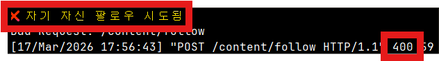</div>
<div>2. 기존 : NULL ➡️ 변경 : 로그인 정보 기록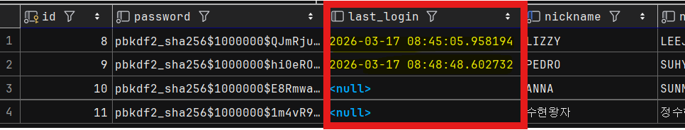</div>
</div>

### 🚫 팔로우 기능 예외 처리(자기 자신 팔로우 차단) 문제 해결
- 목표) 자기 프로필의 팔로우 버튼 클릭 시, `Response(status=400)`와 함께 에러 메시지 전송되어야 함
- 문제) 차단 로직이 작동하지 않고, AJAX POST 요청이 CSRF 검증에 실패하여 view까지 도달하지 못함(DB에 저장되지 않음)
- 단서 1) 403 Forbidden 에러 발생
  - 403은 보안토큰(CSRF)이 누락되어 요청이 차단됐을 때 발생
  - 로그인을 한 상태임에도 서버가 현재 브라우저를 '인증된 상태'로 인정하지 않고 있음 확인
- 단서 2) 자기 자신 팔로우 차단 로직이 작동하지 않음
  - `if user.email == follower_email:` 로직이 정상적으로 작동되지 않음
  - 이는 비교 대상인 `user.email`이 `None`이거나, `request.user`가 `AnonymousUser`(익명사용자)로 인식되어 비교 불가

### 해결 1) 🔐 Django 표준 인증 도입 및 인증 방식 통합
- 기존 `request.session['email']` : Django의 보안 인증 시스템과 연동되지 않아, 
         다른 View에서 `request.user`를 호출하면 로그인 여부를 알 수 없는 `AnonymousUser`로 인식됨
- 변경 `login(request, user)` : 모든 View의 유저 판별 로직을 표준 인증 방식으로 통합(`request.user.is_authenticated`)

### 해결 2) 🔎 사용자 식별 로직 및 변수 충돌 수정
- 기존 : `user = request.session.get('email')`에서 email 추출 후 `User.objects.filter(email=user)`로 DB 재조회
- 변경 : `user = request.user`, `email = user.email`(불필요한 DB 조회 제거 및 코드 간결화)

### 해결 3) 🛡️ AJAX CSRF 보안 이슈 해결
- 기존 : POST 방식의 AJAX 요청 시 별도의 보안 토큰을 보내지 않음
- 변경 : HTML에 `` 추가, JS에 `$.ajaxSetup`로 CSRF 토큰 자동 포함
  - Django는 POST 요청 시 CSRF 토큰을 요구하므로, AJAX 요청에도 반드시 포함해야 함

📌 **배운 점**
- Django의 보안 시스템인 `login(request, user)`를 활용하는 것이 여러모로 좋다. 
  코드가 간단하기도 하고 모든 view에서 `request.user`로 접근할 수 있다.
- login 정보를 DB에 저장한다고 끝이 아니라, `login(request, user)` 함수를 호출해 서버 세션에 유저를 등록해야 인증상태가 된다.
  - 기존 방식에선 DB의 'last_login' 필드가 <null>이었으나, 표준 인증 방식을 도입하자 최종 로그인 기록이 자동으로 업데이트 됐다.
- 팔로우나 게시물 작성처럼 DB 데이터를 수정하는 POST 요청 시에는, CSRF 토큰을 함께 사용해야 서버가 안전하다고 판단해 처리해준다

<br><br><br><br>
  
---

## 2026-03-12

<div style="display: flex; justify-content: center ; gap: 10px">
  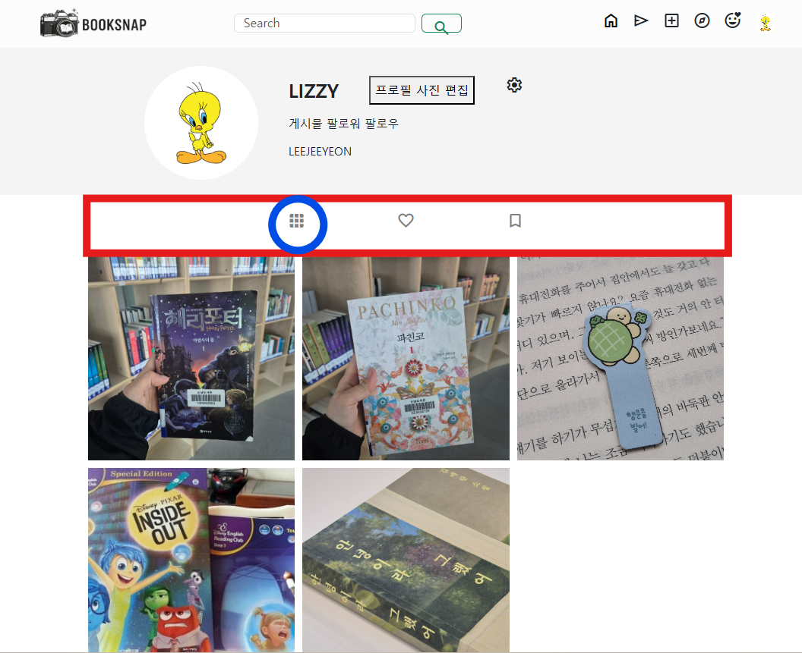
  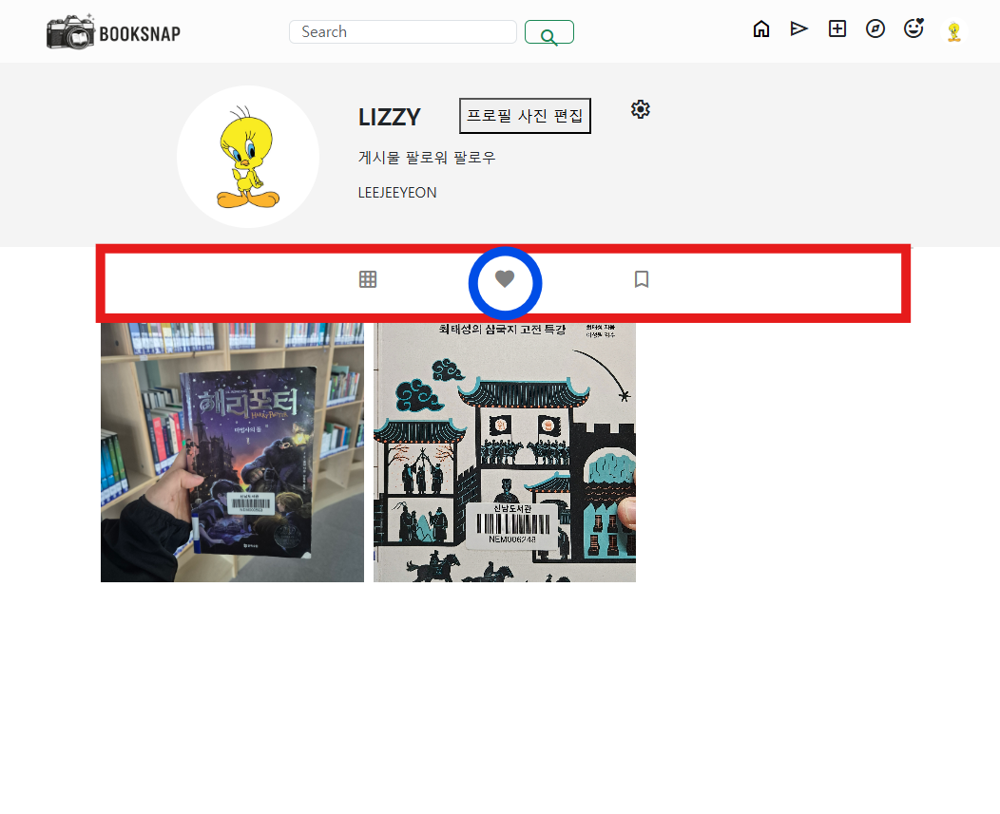
  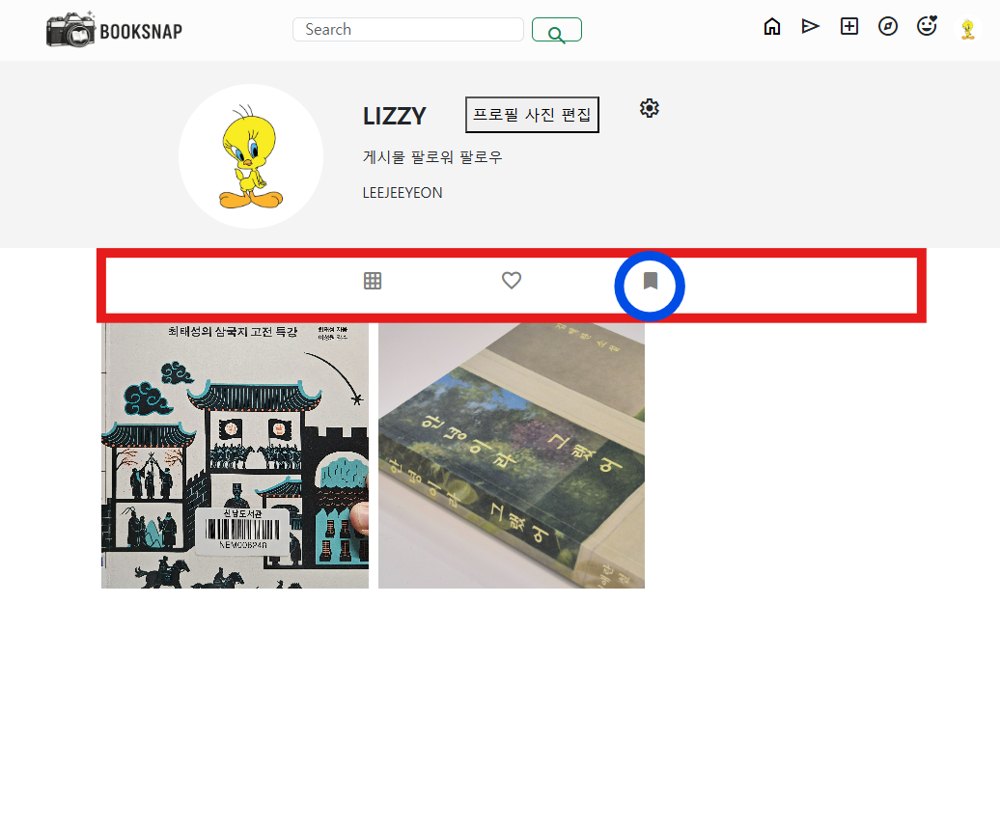
</div>

### 🗂 MySnap 페이지 탭 기능 구현 (Grid / Favorite / Bookmark)
- 상단 아이콘을 통해 다음 세 가지 게시물 목록을 확인할 수 있도록 구현
  - Grid : 내가 업로드한 게시물
  - Favorite : 내가 좋아요한 게시물
  - Bookmark : 내가 북마크한 게시물
<br><br>
- 각 버튼을 클릭하면 해당 게시물 목록만 표시되고 나머지는 숨기도록 구현
```
$('#button_feed_list').click(function () {
  $('#feed_list').css('display', 'flex');
  $('#like_feed_list, #bookmark_feed_list').hide();
});
```
- 🎨 선택된 탭 아이콘 강조 표시 (filled 처리)
```
$('.click-fill').click(function(event){
  $('.click-fill').removeClass('filled');
  $(event.currentTarget).addClass('filled');
});
```

### 📌 좋아요 / 북마크 게시물 조회 로직 추가 (`views.py`)
- 로그인한 사용자가 좋아요 또는 북마크한 게시물 목록을 조회하도록 로직 추가
```
like_list = Like.objects.filter(email=email, is_like=True)\.values_list('feed_id', flat=True)
like_feed_list = Feed.objects.filter(id__in=like_list)
bookmark_list = Bookmark.objects.filter(email=email, is_marked=True)\.values_list('feed_id', flat=True)
bookmark_feed_list = Feed.objects.filter(id__in=bookmark_list)
```
- 게시물이 최신순으로 표시되도록 내림차순 정렬(`.order_by('-id')`)을 적용
<br><br><br><br>

---

## 2026-03-11
<div style="display: flex; justify-content: left; gap: 20px;">
  </div>
<div style="display: flex; justify-content: left; gap: 20px;">
  </div>
<div style="display: flex; justify-content: left; gap: 20px;">
  </div>

### ❤️ 좋아요 / 🔖 북마크 토글 기능 구현
- 피드 하단에 좋아요(하트)와 북마크 아이콘을 추가하고 클릭 시 상태가 변경되도록 구현
### 1. main.html (프론트 UI - 하트 아이콘)
```
<span id="favorite_{{ feed.id }}"
      feed_id="{{ feed.id }}"
      class="favorite material-symbols-outlined filled">
favorite
</span>
```
### 2. main.html JS (좋아요 클릭 이벤트)   
2-1. 클릭한 게시물 번호 확인
```
let favorite_id = event.target.id;
let feed_id = event.target.attributes.getNamedItem('feed_id')
```
2-2. UI 변경 (♡ ↔ ♥)
```
addClass('filled')
removeClass('filled')
```
2-3. AJAX 요청 (서버로 데이터 전송)
```
$.ajax({ data: { feed_id: feed_id },
         method: "POST",
         url: "/content/like" });
```
### 3. urls.py (요청 연결)
- `/contect/like` 요청이 오면 `ToggleLike` view실행
```
path('like', ToggleLike.as_view())
```
### 4. views.py (ToggleLike View)
- AJAX 요청을 처리하는 View
  - 해당 사용자의 좋아요 기록 조회
```
class ToggleLike(APIView):
    def post(self, request):
        feed_id = request.data.get('feed_id')
        email = request.session.get('email')
        like = Like.objects.filter(feed_id=feed_id, email=email).first()
```
  - 없으면 새로 생성, 있으면 `True ↔ False` 토글
```
        if like is None:
            Like.objects.create(feed_id=feed_id, email=email, is_like=True)
        else:
            like.is_like = not like.is_like
            like.save()
```
### 5. models.py (DB 구조)
- `class Like(models.Model):` 실행 → DB(content_like)에 저장
### 6. views.py 실행(Main View)
- 페이지가 다시 렌더링될 때 각 피드의 좋아요 상태를 계산
```
is_liked = Like.objects.filter(feed_id=feed.id, email=email, is_like=True).exists()
```
### 7. main.html (템플릿 반영)
- True → ♥ / False → ♡
```
filled
```

📌 **배운 점**
- 좋아요 기능을 구현하면서 **웹 서비스의 전체 요청 흐름(Front → AJAX 요청 → Server(Django View 처리) → DB → Template)**을 이해함
  - main.html에서 클릭 이벤트 발생
  - JS에서 AJAX 요청을 통해 서버(/content/like)로 데이터 전달
  - views.py에서 요청을 처리하고 models.py의 Like 테이블 데이터를 수정
  - 이후 Main view에서 좋아요 상태를 조회하여 main.html 템플릿에 다시 반영
<br><br><br><br>

---

## 2026-03-06

### 🔄 프로필 이미지 동기화 문제 해결
<br>
<br>
- 기존) 사용자가 피드를 업로드하면 작성자의 정보와 함께 프로필 이미지가 표시 됨
- 문제) 사용자가 프로필을 바꾸면, 전에 업로드했던 피드의 프로필 이미지는 갱신되지 않는 상태로 유지
- 원인) 해당 프로필 부분에, 피드 작성 시점의 사용자 정보(user_id, profile_image)를 직접 사용 (연동되지 않음)
- 해결) 피드에 작성자의 email을 저장, email을 기준으로 user 객체를 조회하도록 구현
  - `class Feed(models.Model):`<br>
        `email = models.EmailField(default='')`
  - `for feed in feed_object_list:`<br>
        `user = User.objects.filter(email=feed.email).first()`
  - 피드 데이터 구성 시 '`user.profile_image`', '`nickname=user.nickname`' 사용 


### 💬 댓글 작성 기능 구현
<div style="display: flex; justify-content: left; gap: 20px;">
  
  
</div>

- 피드 하단에 댓글 입력창을 추가하고 사용자가 댓글을 작성할 수 있도록 구현<br>
  (feed.id를 이용해서 각 피드의 댓글 입력창을 구분 함)<br>
  ```<input id="reply_{{ feed.id }}" type="text" placeholder="댓글 달기..."><br>
  <div class="upload_reply" feed_id="{{ feed.id }}">
- 댓글 입력 후 send 버튼 클릭 시 AJAX 요청을 통해 서버에 전달
  ```let feed_id = event.currentTarget.attributes.getNamedItem('feed_id').value;
  let reply_content = $('#reply_' + feed_id).val();

  $.ajax({
    data: { feed_id: feed_id, reply_content: reply_content },
    url: "/content/reply",
    method: "POST"});
- 댓글 데이터를 Reply 테이블에 저장
  ``` Reply.objects.create(
      feed_id=request.data.get('feed_id'),
      email=request.session.get('email'),
      reply_content=request.data.get('reply_content'))
- 댓글 저장 후 페이지를 새로고침하지 않고 해당 피드의 댓글 목록에 즉시 반영되도록 처리
  ```success: function () {
    $('#reply_list_' + feed_id).append(
        "<div><b>{{ user.nickname }}</b> " + reply_content + "</div>");}

📌 **배운 점**
- 사용자 식별은 고유값으로 관리하는 것이 중요함
  - email을 기준으로 user 정보를 조회하도록 구조를 통일하여, profile_image나 user_id 등 사용자 정보 변경 시 자동 일괄 적용할 수 있었음
  - 또한 Feed에서도 profile_image 등을 직접 저장하지 않고 email을 통해 user 정보를 조회하도록 하여, 사용자 정보 변경 시 자동으로 반영함
- 댓글 기능 구현 과정에서 AJAX를 활용한 비동기 처리 방식을 이해
  - 서버에서는 댓글 데이터를 DB에 저장, 클라이언트에서는 .append()를 사용해 DOM에 댓글을 추가하여 새로고침 없이 댓글이 즉시 반영되도록 구현
- 좋아요 기능은 like_count를 write → update하는 방식과 좋아요 기록을 write → delete하는 방식으로 구현할 수 있음
  - write → update 방식은 구조가 단순하고 성능이 빠르지만, 좋아요 누른 사람의 목록을 조회할 수 없음(단순히 T ↔ F)
  - write → delete 방식은 좋아요를 누르면 like_count +1, 좋아요를 취소하면 like_count -1
  - 추후엔 후자 방법을 써보겠지만, 현재는 전자의 간단한 방식을 사용했음
<br><br><br><br>
  
---

## 2026-03-05

### 📂 프로필 드롭다운 메뉴 구현
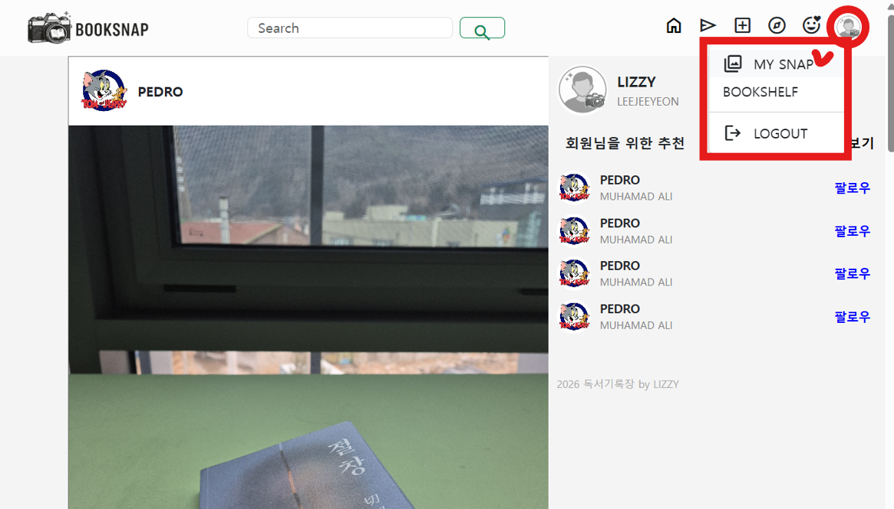<br>
- main.html 상단 프로필 아이콘 클릭 시 드롭다운 메뉴 표시(Bootstrap dropdown 컴포넌트 활용)
- 'MY SNAP → /content/mysnap', 'LOGOUT → /user/logout' 로 이동 (BOOKSHELF 추후 예정)
- **드롭다운 메뉴 레이어 문제 해결**
  - 프로필 드롭다운 메뉴가 오른쪽 피드 영역에 가려지는 문제 발생
  - 피드 영역이 navbar보다 더 높은 stacking context를 가지고 있었기 때문.(피드의 레이어가 더 위)
  - .navbar{ position: relative; z-index: 1050 } 로 문제 해결

### 🖼 MY SNAP 페이지 레이아웃 구현
- /content/mysnap 경로로 이동 시 사용자 프로필 페이지 표시
- flex 레이아웃을 활용하여 프로필 영역과 텍스트 영역을 좌우 배치
- 회원가입 시 profile_image 필드를 기본 이미지로 초기화

### 🔄 프로필 이미지 업로드 및 기능 연동
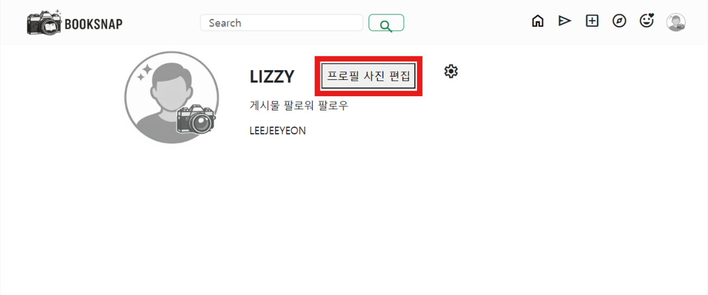<br>
- "프로필 사진 편집" 버튼 클릭(`<button id="button_profileupload">`)
- 숨겨진 file input 실행(display: none, `$('#button_profileupload').click(function(){ $('#input_fileupload').click(); })`)
- 파일 선택 시 onchange 이벤트로 profile_upload() 함수 실행(`input type="file"`, `onchange="profile_upload()`")
- Feed 이미지 업로드와 같은 방법(FormData를 AJAX로 전송)으로 진행 (`$.ajax({ url: "/user/profile/upload", method: "POST" })`)
- Django 서버에서 이미지 파일 저장 후 사용자 프로필 이미지 갱신
(`user/views.py → UploadProfile.post()에서 request.FILES['file']로 파일 수신 후 user.profile_image = uuid_name 저장`)
- 프로필 이미지 교체 시 메인 우측 피드, 네비바, MYSNAP 페이지 등 user.profile_image를 사용하는 모든 영역에 즉시 반영하도록 구현 ⬇️<br><br>

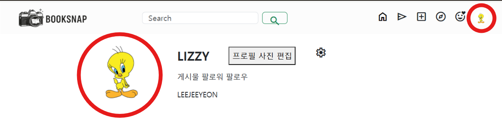<br>
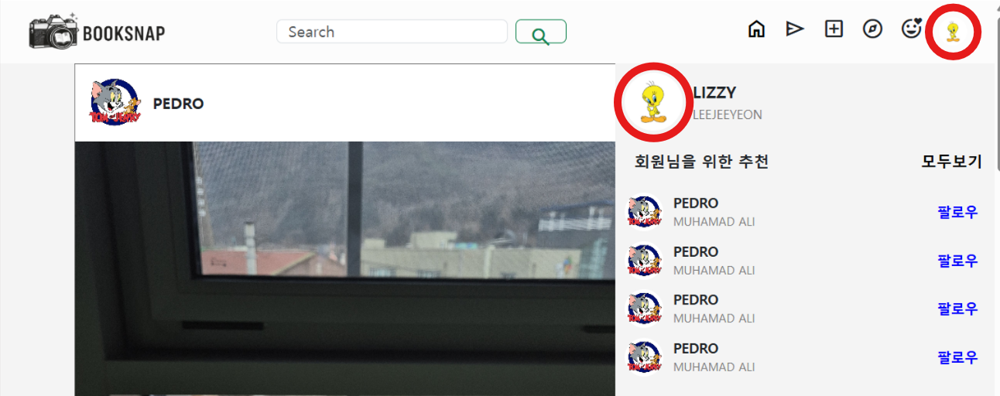<br>

### 👥 사용자별 게시물 프로필 유지
- 다른 사용자 계정으로 로그인할 경우, 해당 사용자가 작성한 feed에는 작성자의 프로필 이미지가 유지된 상태로 표시
- feed 데이터와 user 데이터를 함께 전달하여 템플릿에서 출력({{ feed.user.profile_image }})

📌 **배운 점**
- href의 쓰임
  - href="#" : 현재 페이지의 맨 위로 이동하는 임시 링크. 아직 연결할 페이지가 없을 때 사용
  - href="/content/mysnap" : `<a>` 태그에서 사용하여 클릭 시 해당 URL 경로로 이동할 수 있음
- onchange 이벤트
  - 입력값이 변경되었을 때 실행되는 이벤트
  - 동작 흐름 : 파일 선택 → value 변경 → onchange → profile_upload() 실행 → AJAX로 서버 업로드
- CSS Stacking 문제
  - 여러 요소가 겹칠 때 더 낮은 레이어가 더 높은 레이어 뒤로 숨는 현상
  - 각각의 레이어를 z축 위에 있다고 생각해 'z-index'로 우선순위 조정
<br><br><br><br>

---

## 2026-03-03

<div style="display: flex; justify-content: left ; gap: 20px;">
  
  
</div>


### 🔐 회원가입 기능 구현 (AJAX 기반)
- join.html에서 입력값(email, password, name, nickname) 수집
- $.ajax()를 사용하여 가입 정보를 /user/join으로 POST 요청
- Django Join.post()에서 사용자 생성
- make_password()를 활용해 비밀번호 단방향 암호화 저장
- 가입 성공 시 로그인 화면으로 이동 처리

### 🔑 로그인 기능 구현 (AJAX 기반)
- login.html에서 이메일, 비밀번호 입력값 수집
- $.ajax()를 사용하여 로그인 정보를 /user/login으로 POST 요청
- User.objects.filter(email=email).first()로 사용자 조회
- check_password()로 비밀번호 검증
- 로그인 성공 시 /main으로 이동
- 로그인 실패 시 서버에서 전달한 메시지를 alert로 출력

### 🏠 메인 화면 접근 제어 로직 구현
- request.session.get('email')을 통해 로그인 상태 확인
- 로그인 세션이 없거나 유저가 존재하지 않을 경우 로그인 페이지로 이동
- Feed.objects.all().order_by('-id')로 최신 피드 목록 조회
- render()를 통해 feeds와 user 데이터를 템플릿에 전달

📌 **배운 점**
- 단방향/양방향 암호와의 차이 이해.
  비밀번호는 복호화가 불가능한 단방향 해시 방식으로 저장해야 하며,
  주소나 주민번호 등은 필요 시 복호화가 가능한 양방향 암호화 방식을 사용함
- User.objects.filter(email=email).first()
  filter()은 기본적으로 리스트 형태의 QuerySet을 반환하지만, 
  '.first()'를 활용하면 반복문이나 인덱싱 없이 바로 객체에 접근할 수 있어 코드가 간결해진다.
<br><br><br><br>

---

## 2026-02-26

<div style="display: flex; justify-content: center; gap: 20px;">
  
  
</div>

### 🧾 Join / Login 화면 UI 구현
- Bootstrap form-floating 구조를 활용해 입력 폼 구성
  - 기본 height만 수정 시 스타일이 적용되지 않는 문제 발생
  - form-floating은 height, min-height, padding 등이 동시에 계산되도록 설계되어 있어
    height만 수정 시 min-height 규칙에 의해 무시되기 때문
  - Bootstrap의 min-height, padding, label transform 구조까지 함께 수정하여 정상 동작 구현


📌 **배운 점**
- Bootstrap 컴포넌트는 단순한 스타일 모음이 아니라 여러 CSS 속성이 서로 연결되어 동작하는 구조적 시스템임을 이해
- 특정 속성(height)만 수정하면 다른 속성(min-height, padding, transform 등)에 의해 동작이 유지되거나 깨질 수 있다는 점을 경험
- 원하는 UI를 구현하려면 개별 속성 수정이 아니라 컴포넌트 전체 동작 구조를 파악한 뒤 함께 조정해야 함을 이해
<br><br><br><br>

---

## 2026-02-24


### 📝 Modal2 공유 기능 구현 및 서버 연동
- '#feed_create_button' 클릭 이벤트 구현
- textarea에 입력한 글(content), 업로드한 이미지 파일(file), 작성자 정보(user_id, profile_image)를 jQuery로 수집
- FormData 객체를 생성하여 파일과 텍스트 데이터를 함께 구성
- $.ajax()를 사용해 /content/upload 경로로 POST 요청 전송
- 요청 완료 후 location.replace("/main")로 메인 페이지 재이동 처리

### 🔗 urls.py 경로 연결
- /content/upload 경로를 UploadFeed 뷰와 연결하여 AJAX 요청이 처리되도록 설정
- 🛠 views.py 파일 저장 및 DB 생성
- request.FILES['file']로 이미지 파일 수신
- request.data.get()으로 글 내용 및 사용자 정보 수신
- MEDIA_ROOT 경로에 파일 저장 (uuid 기반 파일명 사용)
- Feed.objects.create()로 새로운 피드 데이터 DB 저장
- Response(status=200) 반환하여 요청 성공 처리

### 🗂 settings.py 및 미디어 경로 설정
- settings.py에 MEDIA_ROOT, MEDIA_URL 설정 추가
- MEDIA_ROOT를 기준으로 업로드 이미지가 media 폴더에 저장되도록 저장 경로 구성
- MEDIA_URL을 활용하여 `{{ feed.image }}` 형태로 이미지 경로를 구성, media 폴더의 파일이 화면에 출력되도록 처리
- uuid 기반 파일명을 생성하여 업로드 파일명 중복 방지

📌 **배운 점**
- (공유하기 클릭 → 데이터 모아서 → 서버에 보내고 → 서버가 저장 → 다시 화면에 보여줌)
- 공유하기 클릭 → <브라우저 JS>  FormData 생성 → AJAX 이용, POST 방식으로 '/content/upload'에 전송 
              → <Django 서버> (urls.py) url(/content/upload)과 UploadFeed와 연결 
                           → (views.py) 'def post(self, request)' 실행(request에서 데이터 꺼내기) 
                           → 'media'에 파일 저장 + 'Feed.objects.create()'로 DB 저장 → 응답 반환 
              → <브라우저>    '/main'으로 이동

- AJAX를 통해 페이지 새로고침 없이 서버와 비동기 통신이 가능함을 이해
<br><br><br><br>

---

## 2026-02-23


### 🪟 Drop 이후 모달 전환 로직 구현(second_modal)
- first_modal, second_modal로 id를 분리하여 모달 상태를 구분
- 이미지 파일이 정상적으로 감지되면 #first_modal은 display: none, #second_modal은 display: flex로 변경
- 기존 e.target 대신 .img_upload_space 선택자로 변경하여 모달 전환 후에도 정상적으로 이미지가 표시되도록 수정
- second_modal에서 왼쪽(70%) 이미지 창과 오른쪽(30%) 글쓰는 창 배치
- second_modal에서 flex 레이아웃을 적용해 이미지(70%)와 글쓰기 영역(30%)을 분리

📌 **배운 점**
- 모달에 id를 지정하여 JS에서 특정 요소를 제어 할 수 있음
- e.target을 .img_upload_space를 사용하여, 드롭 위치가 아닌 second_modal 기준으로 이미지가 표시됨을 이해
<br><br><br><br>

---

## 2026-02-22


### 🪟 Modal 구현 및 동작 연결
- 모달 HTML 구조 및 CSS 스타일링 완료
- `#nav_bar_add_box` 클릭 시 `.modal_overlay`를 `display: flex`로 변경하여 모달 오픈
- `overflow: hidden` 적용하여 배경 스크롤 제거

### 🖱 Drag & Drop 이미지 업로드 구현
- `.img_upload_space`에 `dragover`, `dragleave`, `drop` 이벤트 연결
- `e.preventDefault()`와 `e.stopPropagation()`을 사용해 브라우저 기본 동작 제어
- `dataTransfer.files`를 통해 드롭된 파일 정보 접근
- 이미지 파일인지 검사 후 `background-image`로 미리보기 구현

📌 **배운 점**
- HTML은 화면의 구조를 만들고 JS는 동작을 제어하며, 두 요소가 결합되어 동적인 UI가 완성된다는 것 이해
- 'Drog & Drop'의 내부 흐름(이벤트 발생 → 파일 정보 전달 → 파일 접근 → 화면 반영)을 이해
<br><br><br><br>

---

## 2026-02-21

### 🔄 클래스형 뷰 적용
- 함수형 뷰에서 클래스형 뷰로 구조 변경
- `Main(View)` 형태로 수정
- `urls.py`에서 `Main.as_view()`로 연결

### 🗂 Feed 데이터 템플릿 연동
- `Feed.objects.all()`로 전체 피드 조회
- context에 `{"feeds": feed_list}` 형태로 전달
- 템플릿에서 `` 반복문 적용
- `{{ feed.content }}`, `{{ feed.user_id }}` 등 DB 데이터 동적 출력 구현

📌 **배운 점**
- 함수형 뷰 → 하나의 **함수** 안에서 요청을 처리 (GET/POST를 **직접 분기**해야 함)
- 클래스형 뷰 → 하나의 **클래스** 안에서 여러 요청(GET, POST 등)을 메서드로 **분리해서 처리**

- HTML 서버 → 서버가 **완성된 HTML 화면을 만들어서** 브라우저에 전달
- API 서버 → 서버는 **데이터(JSON)만 전달**하고, 화면은 프론트엔드가 구성
<br><br><br><br>
---

## 2026-02-20

### 🏗 MTV 구조 이해  
- Model: 데이터 구조 정의 및 DB와 연결  
- Template: 화면(UI) 구성  
- View: 요청을 처리하고 Model과 Template를 연결  
- Django는 MTV 패턴을 기반으로 동작함을 구조적으로 이해  

### ⚙ ORM 개념 이해  
- Django ORM(Object Relational Mapping) 개념 학습  
- SQL을 직접 작성하지 않고 Python 코드로 DB 조작 가능  
- `Feed.objects.create()` 형태로 데이터 생성  
- Python 코드가 내부적으로 SQL로 변환되어 실행되는 구조 이해 

### 🗂 Feed 모델 생성  
- `Feed` 모델 정의 
- (content, image, profile_image, user_id, like_count)  
- `makemigrations` / `migrate` 실행  
- `content_feed` 테이블 생성 확인  
- PyCharm Database 콘솔에서 SQL 직접 실행

📌 **배운 점**
- ORM을 사용하면 Model과 DB가 자동으로 매핑되어 SQL을 직접 작성하지 않아도 DB를 관리할 수 있음   
- 레이아웃(프론트엔드)을 먼저 구현한 뒤, 데이터의 동작 원리의 큰 흐름을 이해
<br><br><br><br>
---

## 2026-02-19

### 🔧 Navbar 개선
- flex 기반 space-between 정렬 적용
- flex-wrap: nowrap 설정
- CSS 참고 (studiomeal)

### 📱 Feed 레이아웃 1차 구현
- 화면 분할 구조 구현 (좌측 스크롤 / 우측 고정)

#### ⬅ 왼쪽 피드
- 프로필 사진 영역
- 사진 업로드 UI
- 좋아요 / 댓글 / 보관 아이콘
- 댓글 입력창

#### ➡ 오른쪽 영역
- 추천 회원 목록 UI 구성

📌 **배운 점**
- Flexbox 기반 레이아웃 구조를 직접 구성하며 CSS 속성의 동작 원리를 이해함
- 원하는 UI를 구현하기 위해 CSS 속성을 검색하고 적용해보는 과정을 통해 문제를 해결함
- 부모 요소의 너비와 자식 요소의 배치 방식이 전체 레이아웃에 미치는 영향을 체감함
- 특히 `display: flex`, `justify-content`, `flex-direction`, `position: fixed`를 사용해 봄
<br><br><br><br>
---

## 2026-02-13

### 🎨 프로젝트 로고 제작 및 적용

- 서비스 이름을 **BOOKSNAP**으로 결정
    - BOOK + SNAP의 의미 결합
    - 독서를 사진으로 기록하고 감상평을 남긴다는 컨셉
- 카메라와 책을 활용하여 모던하고 심플한 로고 제작
- navbar 왼쪽에 로고 삽입

### 🛠 Static 이미지 404 문제 해결

- 로고 이미지가 `/static/images/...` 경로에서 로드되지 않음
- Django static 설정 문제로 판단
- `STATICFILES_DIRS` 설정 추가 후 해결

📌 **배운 점**
- Django static 파일 로드 구조 이해
- settings.py 설정의 중요성
- Git을 통한 기능 단위 관리 시작
<br><br><br><br>
---

## 2026-02-12

### 🧩 네비게이션바 레이아웃 구현

- Bootstrap 기반 navbar 구조 설계
- 좌 / 중앙 / 우 영역으로 레이아웃 분리
- 초기에는 모든 요소가 왼쪽으로 정렬되는 문제 발생
  - `d-flex`, `ms-auto` 클래스가 적용되지 않음
  - Bootstrap CSS가 로드되지 않는 것을 확인
  - CDN 링크의 integrity 값 오류로 인해 브라우저가 파일 로드를 차단함
  - integrity 속성 제거 후 정상 작동 확인

📌 **배운 점**
- CDN integrity 속성의 역할 이해
- Bootstrap이 로드되지 않으면 유틸리티 클래스가 무효화됨
- 개발자 도구(Network 탭)로 CSS 로드 여부 확인 가능
